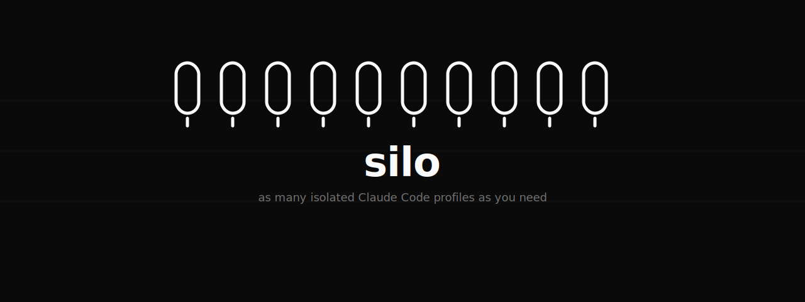
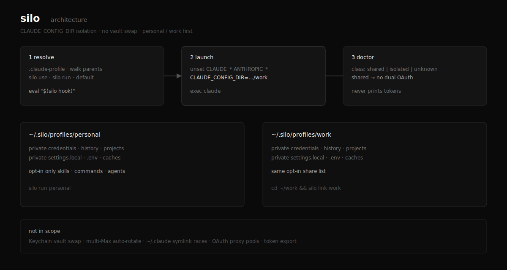

# silo

Isolated [Claude Code](https://code.claude.com) profiles via `CLAUDE_CONFIG_DIR`. One directory per identity - personal, work, clients, extra Max subs, whatever you name - with separate credentials, settings, and history.

[](https://github.com/0xNyk/silo/actions/workflows/ci.yml)
[](LICENSE)
[](https://github.com/0xNyk/silo/releases)

## Install

```bash
curl -fsSL https://raw.githubusercontent.com/0xNyk/silo/main/install.sh | bash
```

Puts the binary at `~/.local/bin/silo`. Checks SHA-256 when the release ships a checksum file. Falls back to `cargo install` if there is no prebuild for your OS.

```bash
VERSION=v0.2.0 bash          # pin a release
INSTALL_DIR=~/bin bash       # custom install dir
SILO_FORCE_CARGO=1 bash      # source only
```

## Agent setup

Point an agent at [AGENTS.md](./AGENTS.md), or run this yourself:

```bash
curl -fsSL https://raw.githubusercontent.com/0xNyk/silo/main/install.sh | bash
export PATH="$HOME/.local/bin:$PATH"
silo bootstrap --wrap --hook          # personal + work
# silo bootstrap --count 10 --wrap    # or ten numbered silos
```

Then finish OAuth in a browser for each profile (agents cannot do this alone):

```bash
silo auth login personal
silo auth login work
```

## Switch profiles

```bash
silo run work                 # or: silo go work
silo-work                     # after bootstrap --wrap / silo wrap install
eval "$(silo use personal)"   # this shell only; then claude
```

## First run

```bash
silo bootstrap --count 10 --wrap --hook
silo auth status
silo auth login s01           # once per profile
silo run s07
silo link work                # pin the current repo
silo doctor --keychain --checklist
```

Needs `claude` on `PATH`.

## Commands

| Command | What it does |
|---|---|
| `silo bootstrap …` | Init, doctor, login checklist; optional `--wrap` / `--hook` |
| `silo init --count 10` | Create `s01`…`s10` |
| `silo profile create a b c …` | Create several names at once |
| `silo auth login <name>` | Open Claude under that silo for `/login` |
| `silo auth status` | Who still needs login |
| `silo run` / `silo go <name>` | Start Claude as that silo |
| `silo wrap install` | Install `silo-<name>` launcher scripts |
| `silo link <name>` | Write `.claude-profile` in the current repo |
| `silo hook` | Shell hook: auto-activate on `cd` |
| `silo share on skills` | Opt-in shared skills (not history) |
| `silo doctor --keychain` | Keychain class + checklist |
| `silo completions zsh` | Shell completions |

No hard cap on how many profiles you keep. Soft limit: 256 creates in a single command (stops typos, not product intent).

## How it works

```
.claude-profile | silo use | silo run | silo-<name>
        │
        ▼
  unset CLAUDE_* / ANTHROPIC_*
  CLAUDE_CONFIG_DIR=~/.silo/profiles/<name>
        │
        ▼
  exec claude
```

| Stays private | Shared only if you opt in |
|---|---|
| credentials, history, projects | `skills/`, `commands/`, `agents/` |

Auth modes: `oauth`, `setup-token`, `api-key`, `bedrock`, `vertex`, `foundry`.



## macOS Keychain

If `silo doctor --keychain` prints class `shared`, use one OAuth silo at a time (or put extras on setup-token / API key). Keeping many logged-in profiles on disk is fine. Running two OAuth sessions at once may not be.

silo never prints tokens and never runs `security … -g`.

## Out of scope

- Multi-Max auto-rotation
- Global Keychain vault swap
- Symlink thrash of `~/.claude`
- Local OAuth proxies
- Token export packs

## silo vs other profile managers

Every tool in this category wraps the same mechanism: Claude Code reads credentials, settings, and history from `CLAUDE_CONFIG_DIR`, so one directory per identity gives full isolation. The differences are tooling around that fact.

- **Plain shell aliases** (`CLAUDE_CONFIG_DIR=~/.claude-work claude`) cover two stable profiles fine. silo starts paying off at ten numbered silos, wrappers, hooks, and doctor checks.
- **[claude-code-profiles](https://github.com/quinnjr/claude-code-profiles)** and **[@remeic/ccm](https://www.npmjs.com/package/@remeic/ccm)** are profile switchers around the same variable. silo adds bulk bootstrap (`--count 10`), six auth modes (oauth / setup-token / api-key / bedrock / vertex / foundry), macOS Keychain conflict detection, and per-repo pinning - shipped as a checksummed binary rather than an npm install.
- **[claude-multiprofile](https://www.npmjs.com/package/claude-multiprofile)** targets Claude Desktop and Claude Code side by side; silo is Claude Code only.

If one of those fits better, use it - the isolation mechanism is identical either way. Descriptions are positioning-level as of July 2026.

## Links

[AGENTS.md](./AGENTS.md) · [SECURITY.md](./SECURITY.md) · [CHANGELOG.md](./CHANGELOG.md) · [Releases](https://github.com/0xNyk/silo/releases)

## Support

Maintained by [Nyk](https://nyk.dev). If Silo helps your work, [sponsor its continued maintenance](https://github.com/sponsors/0xNyk) or follow [@nykdotdev](https://x.com/nykdotdev).

## License

[MIT](LICENSE) © 0xNyk
